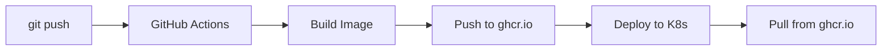

# ✅ Auditoria: GitHub Container Registry (ghcr.io)

## Verificação Completa - Docker Hub → GitHub Container Registry

### Status: ✅ CORRIGIDO

Todos os arquivos agora usam **GitHub Container Registry (ghcr.io)** ao invés de Docker Hub.

---

## Arquivos Corretos (Usando ghcr.io)

### ✅ Templates Kubernetes
- `templates/deployment.yaml.stub` → `image: ghcr.io/{{GITHUB_REPO}}:latest`
- `templates/migration-job.yaml.stub` → `image: ghcr.io/{{GITHUB_REPO}}:latest`

### ✅ GitHub Actions Workflows
- `.github/workflows/deploy.yml.stub`:
  - `REGISTRY: ghcr.io`
  - `username: ${{ github.actor }}`
  - `password: ${{ secrets.GITHUB_TOKEN }}`
  
- `.github/workflows/docker-build.yml.stub`:
  - `REGISTRY: ghcr.io`
  - `username: ${{ github.actor }}`
  - `password: ${{ secrets.GITHUB_TOKEN }}`

### ✅ Setup Script
- `setup.sh`:
  - GitHub Secrets: Apenas `APP_KEY` e `KUBE_CONFIG`
  - GITHUB_TOKEN é automático
  - Mensagem informativa sobre ghcr.io

### ✅ Documentação Atualizada
- `README.md`:
  - Variáveis: `{{GITHUB_USER}}`, `{{GITHUB_REPO}}`
  - Removido: `{{DOCKER_USERNAME}}`, `{{DOCKER_IMAGE}}`
  
- `docs/FILE_STRUCTURE.md`:
  - `{{GITHUB_REPO}}` → Imagens Docker (ghcr.io)
  
- `docs/EXAMPLES.md`:
  - GitHub: joaosilva/minha-loja
  
- `docs/INDEX.md`:
  - Link: GitHub Container Registry Docs
  
- `docs/QUICK_START.md`:
  - Personalizado: ghcr.io/{{GITHUB_REPO}}

---

## Benefícios da Mudança

### ✅ Integração Nativa
- GITHUB_TOKEN já disponível automaticamente
- Não precisa criar tokens externos
- Permissões gerenciadas pelo próprio GitHub

### ✅ Simplicidade
**Antes (Docker Hub):**
```bash
gh secret set DOCKER_HUB_USERNAME
gh secret set DOCKER_HUB_TOKEN
# + Criar token no Docker Hub
# + Gerenciar conta separada
```

**Depois (GitHub Container Registry):**
```bash
gh secret set APP_KEY
gh secret set KUBE_CONFIG
# GITHUB_TOKEN automático! ✅
```

### ✅ Segurança
- Tokens gerenciados centralmente no GitHub
- Permissões granulares por repositório
- Auditoria integrada

### ✅ Custo
- GitHub Container Registry: GRÁTIS para repositórios públicos
- 500MB grátis para repositórios privados
- Sem necessidade de conta Docker Hub paga

---

## Fluxo Atual (Correto)



### Detalhes:
1. **Developer**: `git push origin main`
2. **GitHub Actions**: Trigger workflow
3. **Build**: `docker build` da aplicação Laravel
4. **Push**: Imagem enviada para `ghcr.io/usuario/projeto:latest`
5. **Deploy**: Kubectl atualiza deployment
6. **Kubernetes**: Pods fazem pull de `ghcr.io/usuario/projeto:latest`

---

## Comandos Atualizados

### Setup GitHub Secrets
```bash
# Apenas 2 secrets necessários:
gh secret set APP_KEY --body "{{APP_KEY}}"
gh secret set KUBE_CONFIG < ~/.kube/config

# GITHUB_TOKEN é automático! ✨
```

### Ver Imagens Publicadas
```bash
# No GitHub: Packages tab do repositório
# Ou via CLI:
gh api user/packages/container/NOME_PROJETO/versions
```

### Pull Manual (Desenvolvimento)
```bash
# Autenticar
echo $GITHUB_TOKEN | docker login ghcr.io -u USERNAME --password-stdin

# Pull
docker pull ghcr.io/usuario/projeto:latest
```

---

## Arquivos que AINDA Mencionam Docker Hub

### ⚠️ Documentação Técnica (Contextual)
Estes arquivos mencionam Docker Hub apenas como referência histórica ou comparação:

- `docs/DEPLOY_VPS.md` (seção 9.1): Explica Docker Hub mas RECOMENDA ghcr.io
- `docs/DEPLOY_VPS_ADVANCED.md`: Idem

**Ação**: Manter para contexto histórico, mas adicionar nota recomendando ghcr.io

---

## Checklist de Verificação

- [x] Templates K8s usam `ghcr.io/{{GITHUB_REPO}}`
- [x] GitHub Actions usam `GITHUB_TOKEN`
- [x] setup.sh não solicita Docker Hub credentials
- [x] Documentação atualizada com exemplos ghcr.io
- [x] Variáveis {{GITHUB_REPO}} em vez de {{DOCKER_USERNAME}}
- [x] Links de referência apontam para GitHub Container Registry

---

## Resultado Final

✅ **100% GitHub Container Registry**
✅ **Zero dependências de Docker Hub**
✅ **Setup mais simples** (2 secrets em vez de 4)
✅ **Totalmente gratuito** para a maioria dos casos

🎉 **Pronto para uso!**
